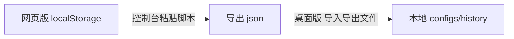

# ModelTrace 桌面端

原生 Windows 客户端。相比「开浏览器访问网页版」，它不启动任何浏览器进程，可从开始菜单一键启动。

## 为什么不用 Worker

网页版依赖 Cloudflare Worker 代理，原因只有两条，且都是**浏览器的限制**：

| 卡点 | 浏览器 | 桌面客户端 |
| --- | --- | --- |
| 设置 `User-Agent` | Fetch 规范禁止，上游 WAF 会 403 | `HttpClient` 可自由设置 |
| 读跨域响应 | 受 CORS 限制 | 无此概念 |

桌面程序两条都不受约束，因此**直接请求上游**即可：少一跳、无需部署、离线也能跑评分。
于是网页版的完整能力（手动测试、API 自动测试、指纹库信息、历史记录、指纹采集）都在本地实现。

## 技术选型

| 项 | 选择 | 理由 |
| --- | --- | --- |
| UI | WPF (.NET 10) | 圆角/阴影/主题体系与现有 CSS 概念对应，还原度高 |
| 评分引擎 | Jint 4.16.4 执行现有 `fingerprint-core.js` | **算法只有一份真相**，见下节 |
| 网络 | `HttpClient` 直连上游 | 不受浏览器限制，可自设 UA |
| 存储 | `%APPDATA%\ModelTrace` | 配置与历史落盘，便于备份 |

实测内存：空 WPF 窗口 102 MB，本应用 155 MB（其中约 52 MB 是 Jint 引擎与指纹库）。
作为对照，WinForms 空窗口 53 MB —— 选 WPF 是为观感与可维护性付出的代价。

## 指纹库更新：不需要重新发布 exe

**指纹库与评分器都放在 exe 同级的 `assets/` 目录**，而非编进程序集：

```
ModelTrace.exe
assets/
  unified_bank.json      指纹库（可热更新）
  fingerprint-core.js    评分器（可热更新）
  challenge-browser.js   挑战生成（可热更新）
```

默认更新通道**直接指向上游原仓库**：

```
https://raw.githubusercontent.com/xqy2006/ModelTrace/main
  ├── data/unified_bank.json        指纹库
  └── static/fingerprint-core.js    评分器
```

指向上游而非本仓库 fork，是因为上游才是指纹数据的唯一来源：少一层中转，
也不会因 fork 未同步而拉到旧库。

上游改动产生两种后果：

| 上游改了什么 | 客户端怎么做 | 要重新装程序吗 |
| --- | --- | --- |
| 只换指纹库（新增模型、重算校准） | 下载新 json 覆盖，比对 `built_at` 判定新旧 | **不用** |
| 改了评分算法 | 比对 SHA-256 发现变化，提示升级程序 | 要 |
| 改了网页界面 | 与本客户端无关 | 不用 |

之所以能这样：评分直接交给 Jint 执行上游的 `fingerprint-core.js`，**而不是把算法翻译成 C#**。
否则上游每改一次算法，客户端就得跟改一次并重新发版。

### 更新流程

客户端在「指纹库与设置」页点「检查更新」即可，无需任何额外配置。流程是：

1. 拉取上游 `static/fingerprint-core.js`，算 SHA-256 与本地比对；
   算法变了则提示升级程序（不静默替换，避免结果不可比）；
2. 拉取上游 `data/unified_bank.json`，校验含 `models` 数组；
3. 用 `built_at` 判断是否比本地更新（上游无清单文件，故以此为主判据）；
4. 确认更新则备份旧库并原子替换，随即重载引擎。

### 自建镜像（可选）

若要把指纹库放到自己的服务器或加速通道，可用 `make-manifest.mjs` 生成带 SHA-256 的
`manifest.json`，客户端检测到清单时会优先采用清单里的地址与哈希。
`tests/ManifestParity` 专门验证 C# 与 JS 对同一批资产算出相同 SHA
（换行归一化必须一致，否则会把「无变化」误判成「有更新」）。

## 从网页版迁移数据

网页版把配置与历史存在浏览器 localStorage，字段命名与桌面版不同。
`tools/export-web-console.js` 在浏览器侧完成转换，导出文件桌面版可直接读。



用法：

1. 桌面版「指纹库与设置 → 从网页版迁移」点「导出控制台脚本」，存到本地；
2. 在网页版按 F12 打开控制台，粘贴脚本内容并回车，浏览器下载 json；
3. 回到桌面版点「导入导出文件」，选择该 json。

合并语义：配置按名称去重、历史按 Id 去重，重复导入不会让条目翻倍。

## 构建与打包

```powershell
cd desktop

# 运行（开发期）
dotnet run --project ModelTrace.Desktop

# 发布单文件 exe（约 4 MB，依赖机器上已有的 .NET 10 桌面运行时）
dotnet publish ModelTrace.Desktop -c Release -r win-x64 --self-contained false -o ./publish

# 生成指纹库更新清单
node make-manifest.mjs dist
```

## 开始菜单项

程序内点「添加 / 移除开始菜单项」即可，也可用命令行：

```powershell
ModelTrace.exe --register-start-menu     # 注册
ModelTrace.exe --unregister-start-menu   # 移除
```

快捷方式写在用户级开始菜单目录，不写注册表、不装服务：

```
%APPDATA%\Microsoft\Windows\Start Menu\Programs\ModelTrace.lnk
```

## 验证

`tests/` 下四个可执行项目覆盖了本项目的关键假设，每个都会断言并在失败时以非零码退出：

| 项目 | 验证内容 |
| --- | --- |
| `JintEngine` | Jint 能执行现有 `fingerprint-core.js`（含 `\p{L}` 正则与 `matchAll`），端到端评分可用 |
| `CryptoShim` | 注入的 Web Crypto 垫片语义与浏览器一致（值域、原地填充、UUID v4 格式） |
| `UpstreamUpdate` | **真实联网**从上游拉取指纹库，含「检测到更新 → 下载 → 写入 → 备份 → 复检」全流程 |
| `ManifestParity` | C# 与 JS 对同一批资产算出相同 SHA-256（自建镜像通道时才会用到） |
| `MemoryProfile` | 分阶段测出 Jint 与指纹库的内存开销 |

```powershell
dotnet run --project tests/JintEngine
dotnet run --project tests/CryptoShim
dotnet run --project tests/UpstreamUpdate     # 需联网；无网络时返回 2 表示跳过
node make-manifest.mjs dist && dotnet run --project tests/ManifestParity -- dist/manifest.json
dotnet run --project tests/MemoryProfile -c Release
```

## 目录结构

```
desktop/
├── ModelTrace.Desktop/        客户端主程序
│   ├── Services/              引擎、上游客户端、资产仓库、开始菜单项
│   ├── ViewModels/            视图模型与转换器
│   ├── Themes/                设计令牌与深浅主题
│   └── MainWindow.xaml        三个工作区界面
├── tools/                     浏览器控制台导出脚本
├── tests/                     关键假设的验证程序
└── make-manifest.mjs          自建镜像通道用的清单生成器
```

## 分支说明

桌面端在独立的 `desktop` 分支上维护，**不影响 `main` 的 Python 版与 Worker 版**。
`main` 分支不含 `desktop/` 目录，两边的 GitHub Actions 也不会互相触发
（工作流均按 `paths` 过滤）。

## 已知限制

- **框架依赖发布**：目标机器需装 .NET 10 桌面运行时。若要单文件免安装，改用 `--self-contained true`（体积增至约 70 MB）。
- **指纹采集**只负责请求并落盘 jsonl，数值拟合仍由仓库的 `bank_builder.py` 完成，未在 C# 中重写。
- **自定义指纹库**（多库切换）未实现，客户端固定使用统一全局库 `unified_bank.json`。
- 上游 API 的三种格式（Responses / Anthropic / Chat）自动探测逻辑已移植，但**尚未联网实测**。
